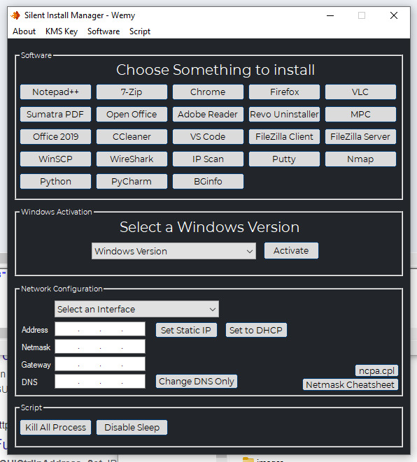

# Silent Install Manager  
Just a personal launcher I use to quickly install things I frequently use or need to do on a VM.

This started as a way to learn scripting. \
The fisrt version was done with AutoIt, but then I rewrote everything in Python (with tkinter for the GUI).

<p align="center"></p> 

There probably is a faster and easier way to do the same thing but like I said, I'm still learning.  

---

There's two differents verison. 
- 1 (offline) containing all the differents .exe. The downside is that the archive can be quite big (+1GB).
- 1 (online) who will only download what you want to install. The downside is that an internet connexion si required.

Python is not installed by default on Windows, so I used [auto-py-to-exe](https://pypi.org/project/auto-py-to-exe/) to "compile" and executable.

If you wish to do it yoursefl :

```bash
git glone https://github.com/wem-r/sim.git
cd sim
```
for the Offline version

```bash
cd SIM-Offline
python3 auto-py-to-exe
```

for the Online version

```bash
cd SIM-Online
python3 auto-py-to-exe
```

