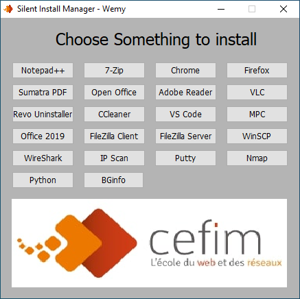
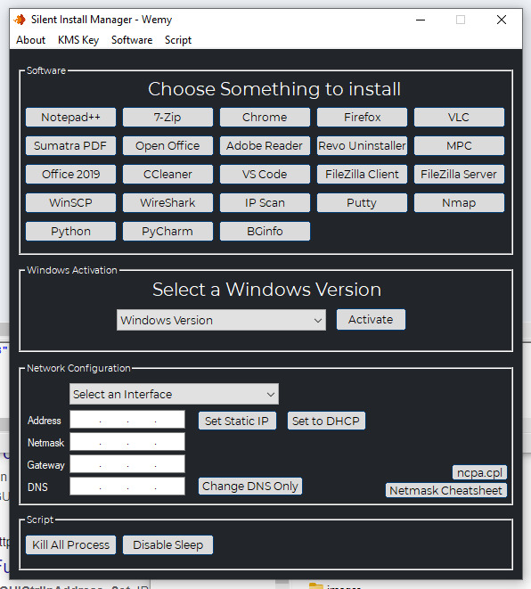

# Silent Install Manager  
Just a personal "launcher" I use to quickly install things I frequently use/install on virtual machines.

  

  

    
Currently rewriting it in python (and adding a few features)

    

      
    
  

There probably is a faster and easier way to do the same thing but hey, I'm still learning.  

To [download](https://wemy.ninja/sim/) the whole archive 
